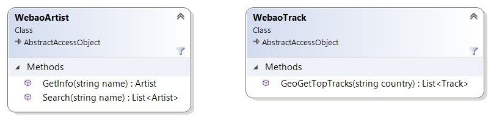
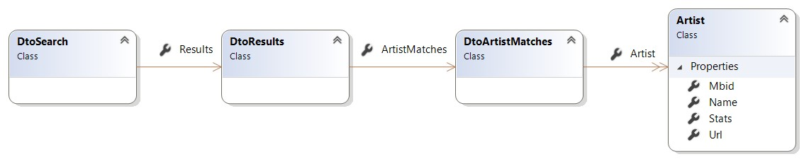
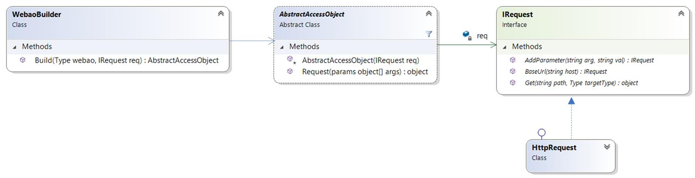

# Enunciado do Trabalho 1

**Data limite de entrega: 6 de Abril**

Use como base do seu projecto a solução Visual Studio do repositório **Webao**.

Pretende-se desenvolver a biblioteca **Webao** (_Web Access Object_) inspirada
no conceito de _Data Access Object_ para Web --
https://en.wikipedia.org/wiki/Data_access_object.
Os _web access objects_ disponibilizam métodos que retornam **objectos de
domínio** (e.g. Student, Account, Artist, Track, Team, League, etc..) escondendo
os detalhes de acesso à fonte de dados (e.g. base de dados).

A biblioteca **Webao** permitirá construir _web access objects_ com métodos que
retornam objectos de domínio com base na informação obtida de uma Web API
Restful.
Esta ideia é inspirada nos objectivos da biblioteca [Retrofit](https://square.github.io/retrofit/).
De forma simplificada e informal, uma Web API Restful pode ser entendida como
uma API acedida via HTTP que retorna dados em formato JSON
(https://www.json.org/).
As classes `WebaoArtist` e `WebaoTrack` exemplificam dois tipos de _web access
objects_ com métodos para obtenção de artistas e músicas (i.e. `Artist` e
`Track`).

 

A informação devolvida por estes _web access objects_ é obtida neste exemplo a
partir da [API Restfull Last.fm](https://www.last.fm/api/rest). 
Os métodos destes _data acess objects_ acedem aos seguintes URLs (deverá
registar-se na Last.fm Web API e obter uma `api_key ` para realizar os pedidos
exemplificados):

* `GetInfo(“muse”)` -- http://ws.audioscrobbler.com/2.0/?method=artist.getinfo&artist=muse&api_key=***&format=json
* `Search(“muse”)` -- http://ws.audioscrobbler.com/2.0/?method=artist.search&format=json&artist=muse&api_key=***
* `GeoGetTopTracks(“australia”)` -- http://ws.audioscrobbler.com/2.0/?method=geo.gettoptracks&country=australia&api_key=***&format=json

Para que as instâncias destas classes realizem os pedidos exemplificados, estas
devem ser definidas e anotadas da seguinte forma:

<table class="table">
<tr class="row">
<td>

```csharp
[BaseUrl("http://ws.audioscrobbler.com/2.0/")]
[AddParameter("format", "json")]
[AddParameter("api_key", "************")]
public class WebaoArtist : AbstractAccessObject
{
  public WebaoArtist(IRequest req) : base(req) {}

  [Get("?method=artist.getinfo&artist={name}")]
  [Mapping(typeof(DtoArtist), ".Artist")]
  public Artist GetInfo(string name) {
      return (Artist)Request(name);
  }     
  [Get("?method=artist.search&artist={name}")]
  [Mapping(typeof(DtoSearch), ".Results.ArtistMatches.Artist")]
  public List<Artist> Search(string name) {
      return (List<Artist>)Request(name);
  }
}
```

</td>
<td>

```csharp
[BaseUrl("http://ws.audioscrobbler.com/2.0/")]
[AddParameterAttribute("format", "json")]
[AddParameterAttribute("api_key", "***********")]
public class WebaoTrack : AbstractAccessObject
{
  public WebaoTrack(IRequest req) : base(req) { }

  [Get("?method=geo.gettoptracks&country={country}")]
  [Mapping(typeof(DtoGeoTopTracks), ".Tracks.Track")]
  public List<Track> GeoGetTopTracks(string country) {
      return (List<Track>) Request(country);
  }
}
```

</tr>
</table>

As anotações têm o seguinte papel:
* `BaseUrl` - DNS e caminho a incluir em todos os pedidos.
* `AddParameter` - _query-string parameter_ a adicionar a todos os pedidos.
* `Get` -- especifica o path a concatenar com o `BaseUrl` para formar o URL do pedido.
* `Mapping` - especifica: 1) o tipo para o qual deve ser convertido a resposta JSON (e.g. `typeof(DtoArtist)`) e 2) o grafo de propriedades que têm que ser acedidas para obter o resultado a retornar.

Por exemplo no caso do método `search()` o caminho `.Results.ArtistMatches.Artist` especifica as propriedades que devem ser percorridas no grafo da imagem seguinte desde `DtoSearch` até chegar a `List<Artist>`:

  

Cabe à classe `WebaoBuilder` instanciar os _web access objects_ (i.e.
`WebaoArtist` e `WebaoTrack`) e processar as informações anotadas nessas classes
**configurando devidamente estas instâncias bem como o objecto `IRequest`**.

De notar que os _data access objects_ requerem uma instância de `IRequest`
através da qual o seu tipo base `AbstractAccessObject` realizará os pedidos HTTP
à Restful API, conforme ilustra o diagrama de classes seguinte.

 

O método `Get` da instância de `IRequest` recebe como parâmetro o URL do pedido
(`path`) e o tipo (`targetType`) para o qual será convertido a resposta JSON. 
Ou seja, no exemplo anterior do método `search()` o parâmetro `targetType`
receberá o tipo presente na anotação correspondente a `typeof(DtoSearch`).

A listagem seguinte ilustra o exemplo de commo realizar pedidos através de `HttpRequest`
às rotas de pesquisa de artistas (`method=artist.search`) e _top tracks_ (`method=geo.gettoptracks`)
do Last.fm Web API.

```csharp
HttpRequest req = new HttpRequest();
req.BaseUrl("http://ws.audioscrobbler.com/2.0");
req.AddParameter("format", "json");
req.AddParameter("api_key", "************");
/*
 * Search for band Muse
 */
DtoSearch dto = (DtoSearch) req.Get(
    "?method=artist.search&artist=muse", 
    typeof(DtoSearch));
Assert.AreEqual("Muse", dto.Results.ArtistMatches.Artist[0].Name);
Assert.AreEqual("Mouse on Mars", dto.Results.ArtistMatches.Artist[3].Name);
/*
 * Get top tracks from Australia
 */
DtoGeoTopTracks aus = (DtoGeoTopTracks) req.Get(
    "?method=geo.gettoptracks&country=australia", 
    typeof(DtoGeoTopTracks));
List<Track> tracks = aus.Tracks.Track;
Assert.AreEqual("The Less I Know the Better", tracks[0].Name);
Assert.AreEqual("Mr. Brightside", tracks[1].Name);
Assert.AreEqual("The Killers", tracks[1].Artist.Name);
```

## Parte 1

Use como base do seu projecto a solução Visual Studio do repositório **Webao**.

Implemente a solução tendo em conta a sua eficiência. 
Os métodos dos _web access objects_  devem **realizar o mínimo de operações de
reflexão**. **Deve maximizar o trabalho de reflexão na instanciação**.

Além dos testes unitários fornecidos que validam o funcionamento dos _data
access objects_ para a Web API da Last.fm deve ainda definir outros dois _data
access objects_ para outra Web API Restful à sua escolha (e.g. futebol,
notícias, filmes, ou outra).

## Parte 2

Faça uma implementação de `LastfmMockRequest` que implementa `IRequest` e que
retorna os objectos de domínio a partir de definições `hard-coded` presentes na
própria classe. 
Realize testes unitários em que os _data access objects_ são construídos para
este `LastfmMockRequest`.

Faça igualmente um outro _mock_ para a outra Web Api que selecionou, incluindo
os respetivos testes unitários.
